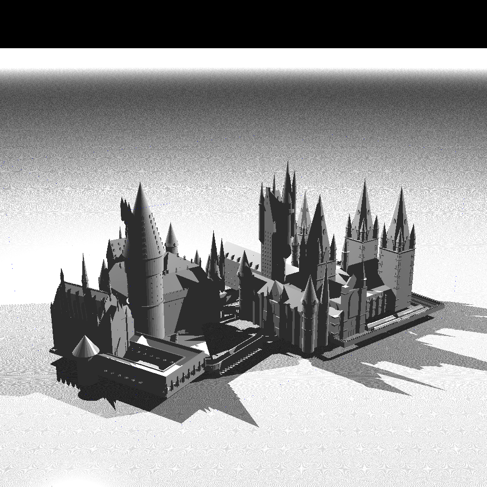
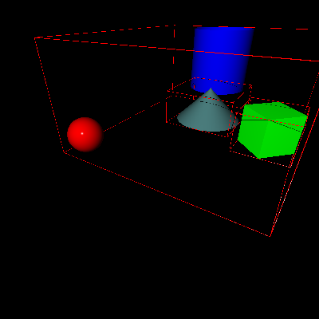
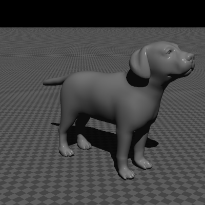
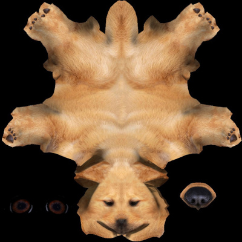
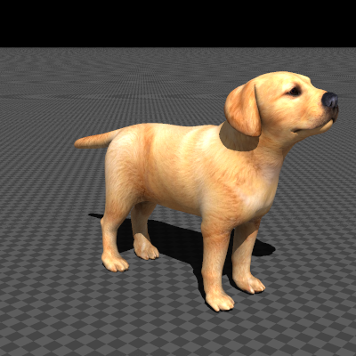
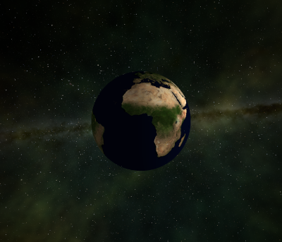
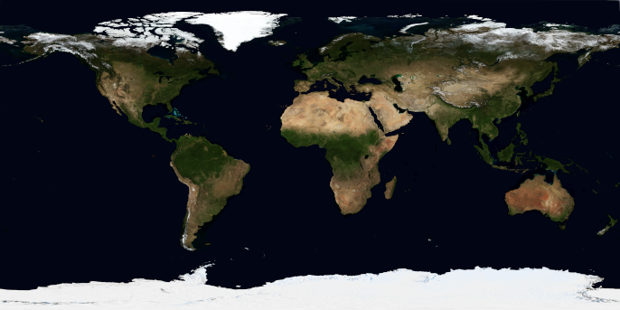

# RayTracer

## An experiment in implementing a Ray Tracing renderer in C#.

This project is a coding experiment with two goals in mind:

* Learn about the math behind ray traced graphics generation and
* Implement the project using Test Driven Development (TDD).

### Ray Tracing
Ray tracing is a methodology of rendering a 2 dimensional image of 3 dimensional graphical environment. The general process is to project
rays from a "camera" or eye point through a screen into the environment.  The closest surface interaction is discovered and the light contributions
to that point as it appears on the screen are calculated.  Depending on the material being simulated, reflections or refractions may be part
of the calculations.  The following image, from Wikipedia Commons graphically shows the process.

### Architecture

The general architecture of the project is object-oriented with a `World` object at the top.  The `World` defines the top-level coordinate space 
where all of its constituients are placed.  The constituients consist of two types of objects: `Shape`s and `Light`s.

There is one style of light currently defined.  It is a simplified point source called `LightPoint`.  It is defined as having a position in the world
and emits a particular color of light. The inverse square law is not considered in light calculation.  Currently, `LightPoint`s only exist in the
`World` space.

The other main inhabitants of the `World` are `Shape`s. The basic shapes are `Sphere`, `Cube`, `Cone` and `Cylinder` along with a host
of others.  These shapes can have 
color, ambient light contribution, diffusion, a specular highlight, shininess, reflectivity, a refractive index and transparancy.  Each `Shape` is
defined in a "unit" sense, and then supplied with a transformation that defines the location, size and orientation of the `Shape` in the context of
the space that it inhabits.  The difference between the `Shape` objects amounts to how they handle the question, "Where, if at all, does this light ray
intersect you?"

The final inhabitant of the `World` space is a special form of `Shape` called a `Group`.  Its function is to be a container for `Shapes`.  It can
contain any of the basic `Shape`s as well as other `Group`s, forming a containing tree. The `Group` creates a local coordinate space within it, which 
is then transformed into the coordinate space containing the group.  This permits a collection of shapes to be transformed as a unit.  One important 
aspect of the `Group` is as a performance enhancement. The picture above shows a bounding box around a collection of `Shape`s.  These `Shape`s are
in a `Group` whose bounding box is shown in the red lines.  The optimization is that before the renderer trys to determine whether or not it intersects
each of the `Shape`s in the `Group`, we first ask whether or not the ray intersects the `Group`'s bounding box.  This is a simple go-nogo test to
decide whether or not to test the `Shape`s within the `Group`.

There are some special `Shape`s.  They are two-dimensional `Shape`s in the three dimensional `World`.  One is `Plane`.  A `Plane`, quite simply is
an object that is flat, its x coordinate is always zero and the other two extend infinitely, both positively and negatively.  
The other basic two-dimensional `Shape` is the `Triangle`.  It is defined by three points in the local space in which it is defined.  `Triangle`s 
are combined to create complex surfaces, such as the castle at the top of this article.  A special case of the `Triangle` is the `SmoothTriangle`.
`SmoothTriangle`s are a subclass of `Triangle` that have an additional hint at each of the verticies that allow an interpolation of the direction
of the surface normal vector, simulating a curved surface.

Attempting to keep the mathematics readable, I used the Math.NET package to implement the vector and matrix operation and added overloaded operators
to describe the usual operations found in ray-tracing graphics.  These are implemented by the `Tuple`, `Vector`, `Point` and `MatrixOps` classes.

The rendering operation, as shown above consists of setting a view (or camera) position, establishing the viewing plane (or canvas) and then sending
rays through each pixel of the viewing plane into the scene to determine the color returned.  The `Camera`, `Canvas` and `World` classes implement this
operation.

### Texture Mapping
Texture mapping, as defined by the Wikipedia, is, "Texture mapping is a method for defining high frequency detail, surface texture, or color information 
on a computer-generated graphic or 3D model. Its application to 3D graphics was pioneered by Edwin Catmull in 1974." The basic mechanism that I use is
called UV mapping.  That Is, I take a point on a 3D object and map it via some function to a 2D texture mapping.  This mapping is usually generated by an
object creation tool, such as Blender.  I have created mappings for two kinds of 3D objects: SmoothTriangle and Sphere.

For the smooth triangle, Each vertex of the triangle is supplied with a texturing vertex, which is a mapping of that vertex to the vertex of a triangle
on the 2D texture.  The point within the triangle is described by its proportional distance from each of the verticies of the 3D triangle. These 
cooridinates are calle the Barycentric Coordinates. This proportional
distance is mapped to the 2D triangle.  It need not be the same shape as the 3D triangle.  The texture map point is then used for the color of the
intersection.  A discussion of Barycentric Coordinates may be found at _ScratchaPixel 2.0_, referenced below, and at Wikipedia, at 
[Barycentric Coordinates](https://en.wikipedia.org/wiki/Barycentric_coordinate_system). 

For example, below, I have a dog, represented by a mesh of triangles.  Each ray intersection is mapped onto the 2D dog texture, which results in a
textured dog.

  

From Wikipedia, here's an animated demo of how the 2D texture is mapped to a 3D object.  Note that the distortions for the shape of the house are handled.

The mapping to a sphere, was pretty simply a trigonometric mapping from a point on a sphere to a 2D mercator mapping.  In the example below, I
used two spheres.  One for the earth, and one for the space around it.  I found the NASA "Blue Marble" mappings for the earth and took a mapping of 
the galaxy for the outer sphere.

 

### ToDo
<dl>
<dt>Bump Mapping</dt>
<dd>Bump mapping is another technique to improve the image without adding surface detail with more triangles.  The technique consists of having
a "bump texture" map tha instructs the rendering engine to modify the normal vector of the intersection, simulating small purturbations of the 
surface.</dd>
<dt>Performance</dt>
<dd>The current performance isn't sparkling. I programmed it using a naive use of storage management, so the number of calls to new is probably 
excessive.  I have parallelized the reendering operations, so that all cores of the CPU are engaged. Another more effective performance 
enhancement would be to use a GPU to do the ray tracing calculations.</dd>
</dl>

### Acknowledgements
The code, while my own, is based on algorithms and constructs that I obtained from:

* Buck, Jamis,(2019) _The Ray Tracer Challenge_. Raleigh: Pragmatic Programmers (https://pragprog.com/book/jbtracer/the-ray-tracer-challenge)
* _Graphic Gems_ code repository on GitHub, https://github.com/erich666/GraphicsGems.
* _ScratchaPixel 2.0_, a collection of computer graphics tutorials, http://www.scratchapixel.com/
* _3D Models For Free_, a collection of 3D models https://free3d.com/ 

I developed the features using a TDD methodology wherein the features are described by a series of tests. The project code was
implemented to satisfy and made to pass each test.  The general style of 
these tests is described in the book, _The Cucumber Book, Second Edition_ by Matt Wynne and Aslak Hellesøy, with Steve Tooke,
published by Pragmatic Programmers(https://pragprog.com/book/hwcuc2/the-cucumber-book-second-edition). My particular implementation
was via Visual Studio's Unit Test capabilities (https://docs.microsoft.com/en-us/visualstudio/test/quick-start-test-driven-development-with-test-explorer?view=vs-2017).

I used the Math.NET Numerics package (https://numerics.mathdotnet.com/) to implement the matrix and vector operations,
rather than build them myself.
